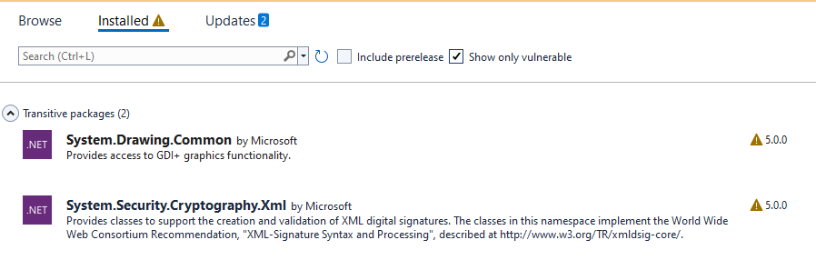

# custom module debugging solution
- https://github.com/mthemark/custom-module-example

> custom module examples for decisions to investigate issues identified with custom modules.
>- see .\Logs\{version} for details of each outcome of each module
>- see .\modules for built modules

# Transitive Packages With Issues (DecisionsSDK 8.16.0)
